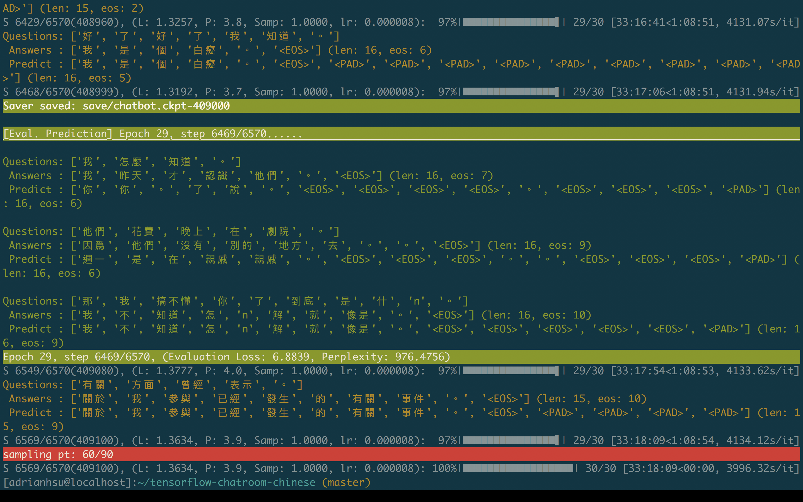
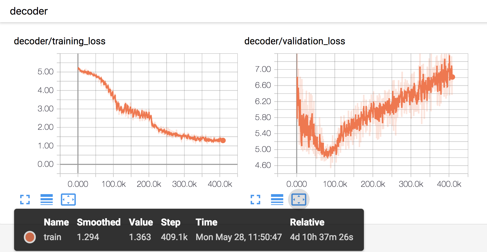

#  tensorflow-chatbot-chinese

> 🏃 [Chinese chatbot] tensorflow implementation of seq2seq model with bahdanau attention and Word2Vec pretrained embedding

<p align=center><a target="_blank" href="https://opensource.org/licenses/MIT" title="License: MIT"></a><a target="_blank" href="http://makeapullrequest.com" title="PRs Welcome"></a></p>  


This repo is based on [this article](https://blog.csdn.net/liuchonge/article/details/79021938), written by [liuchongee](https://blog.csdn.net/liuchonge).


## How-to

#### [option 1] re-train the model

```shell
$ git clone https://github.com/AdrianHsu/tensorflow-chatbot-chinese.git
# put your own training/eval data in the correct path, as shown above
$ ./run.sh
```

#### [option 2] testing the model with pretrained saver file

1. You should download the pretrained model [here](/) and then put it into `save/`directory.
2. make sure your input is already put in the correct path, and also it is pre-processed by **text segmentation** APIs, for example, *jieba*.

```
$ ./hw2_seq2seq.sh
```


## How-to (web)

You have to download the frozen model first.

```
$ ./download_model.sh
```

And then just directly run the server file.

```
$ python3 server.py
```

You'll need `aiohttp`, `python-socketio` to run this. The result will be shown on `https://localhost:8080`.  
WARNING: do not install `socketio`, this is not the same as `python-socketio`!!

## Hyperparameters

```Python
MAX_SENTENCE_LENGTH = 15 # abandon those sentences with > 15 words
special_tokens = {'<PAD>': 0, '<BOS>': 1, '<EOS>': 2, '<UNK>': 3}
emb_size       =     300

# Model parameters

num_layers = 2
rnn_size   = 2048 # GRU cell
keep_prob  = 1.0
vocab_num  = 10561
min_cnt    = 100 # min counts, we only preserver those words appears >= 100 times
num_epochs = 50
batch_size = 250

lr         = 0.5
lr = tf.train.exponential_decay(...
       decay_steps=3250, decay_rate=0.95, staircase=True)
```

- optimizer: `GradientDescentOptimizer()`
- schedule sampling: `inverse sigmoid(0.88 to 0.5)`
- attention method: [Bahdanau Attention](https://arxiv.org/abs/1409.0473)
- random seed are all fixed to `0`.


## Model Structure


- Attention Method: Bahdanau Attention
- RNN Cell : GRU


## Directory Tree (source code)

```Shell
$ tree -L 1
.
├── clean.sh # clean up the `logs/` and `save/`
├── embeddings.npy # [vocab_num, emb_size] matrix, not used in the final version
├── handler.py # data handler
├── hw2_seq2seq.sh # script for testing data
├── logs # logs for tensorboard
├── model_seq2seq.py # training, validation, inference session & model buliding
├── output.txt # output default path for testing
├── perplexity.sh # not used
├── README.md
├── run.sh # re-train the model
├── save # model saver checkpoint
├── test_input.txt # input default path for training
├── util.py # print function, inverse sigmoid sampling function
├── idx2word.pkl
├── word2idx.pkl
└── word2vec.model # generated by gensim Word2Vec model 
```


## Directory Tree (data)

The data for training/validation is **only** a txt file named **conversation.txt**, and I put it in:

```
/home/data/mlds_hw2_2_data/conversation.txt
```

You could modify the path through passing an argument `—data_dir`.

Also, if you want to use your own data, you should modify the `model_seq2seq.py` , which is originally set to: 

```Python
filename = '/conversation.txt' # text segmentation is already finished
total_line_num = 3599478
train_line_num = 3587000
eval_line_num  =   12478 

emb_size       =     300 # embedding size
PKL_EXIST      =    True # if you want to re-train the GenSim model, you should set it False
```


## Data Format

##### conversation.txt

```Shell
這 不是 一時 起意 的 行刺
而是 有 政治 動機
上校 , 這種 事
+++$+++
他 的 口袋 是 空 的
沒有 皮夾 , 也 沒有 身分證
手錶 停 在 4 點 15 分
大概 是 墜機 的 時刻
他 的 降落傘 被 樹枝 纏住 了
```

1. Every dialogs are split by `+++$+++`
2. the prior sentence will be input, and the sentence itself will be ground truth (pair format)
3. for example (this is for training/validation):

```
[[['這', '不是', '一時', '起意', '的', '行刺'], ['而是', '有', '政治', '動機']],
[['而是', '有', '政治', '動機'], [‘上校’, '，', '這種', '事']], ...]
```


## Number of Data

```Shell
# train
original line num: 3587000
used data num:     1642549
# validation
original line num:   12478
used data num:        4762
```


### Data preprocessing

1. `min_count` : 100
2. `MAX_SENTENCE_LENGTH`: 15
3. `MIN_SENTENCE_LENGTH`: 2, therefore, those sentence with only 1 word will be abandoned
4. `unk_num / float(len(sent)) > 0.1`: for example, if there are 10 words in this sentence, with only 1 <UNK>, then it will be preserved


## Pretrained Word2Vec using Gensim

```Python
raw_line.append(['<PAD>'] * 3999999) # to ensure <PAD> will be in index 0 (after sort)
raw_line.append(['<BOS>'] * 100)
raw_line.append(['<EOS>'] * 50)
raw_line.append(['<UNK>'] * 2999999)  # to ensure <UNK> will be in index 3 (after sort)

...
(in for loop)
line = text_to_word_sequence(line, lower=True, split=" ") # Keras API
line.insert(0, '<BOS>')
line.append('<EOS>')
raw_line.append(line)
...
self.model = Word2Vec(raw_line, size=emb_size, 
                      sorted_vocab=1, min_count=min_count, workers=4)

```


## Experimental Results

It takes about **30 hours** (with one 1080Ti ) to make the training loss decrease from **5.8** to **2.5**, (the generated sentence looks quite okay after training loss <= 2.5).



### Correct description

```
Questions: ['好', '了', '大家', '到此爲止', '了', '。']
Answers : ['請', '讓', '當事人', '離開', '讓', '他', '走', '吧', '。', '<EOS>'] 
Predict : ['請', '讓', '當事人', '離開', '我', '就', '走', '吧', '。', '<EOS>']

Questions: ['這下', '讓', '我', '看看', '啊', '。']
Answers : ['再給', '我', '一分鐘', '不行', '嗎', '。', '<EOS>'] 
Predict : ['再給', '我', '一分鐘', '不行', '。', '<EOS>'] 

Questions: ['高', '譚市', '盡', '在', '你', '掌握', '之中', '了', '。']
Answers : ['這樣', '做', '是', '不', '對', '的', '。', '<EOS>']
Predict : ['這樣', '做', '是', '不', '對', '的', '。', '<EOS>']
```


### Irrelevant but reasonable descriptions

```
Questions: ['別', '激動', '別', '激動', '。']
Answers : ['把', '武器', '放下', '。', '<EOS>'] (len: 16, eos: 5)
Predict : ['我們', '沒事', '吧', '。', '<EOS>']
 
Questions: ['最糟', '的', '就是', '讓', '他', '知道', '。']
Answers : ['我們', '害怕', '。', '<EOS>']
Predict : ['他', '是', '我', '的', '兒子', '的', '。', '<EOS>']

Questions: ['起來', '你', '沒事', '吧', '。']
Answers : ['不好意思', '姐姐', '剛才', '真的', '沒', '看到', '你', '。', '<EOS>'] 
Predict : ['沒事', '。', '<EOS>']

Questions: ['我愛你', '。']
Answers : ['上星期', '我', '在', '教堂', '問', '上帝', '。', '<EOS>'] 
Predict : ['我', '也', '愛', '你', '。', '<EOS>']
```


## Training / Evaluation Loss

It takes about **30 hours** (with one 1080Ti ) to make the training loss decrease from **5.8** to **2.5**, (the generated sentence looks quite okay after training loss <= 2.5).



